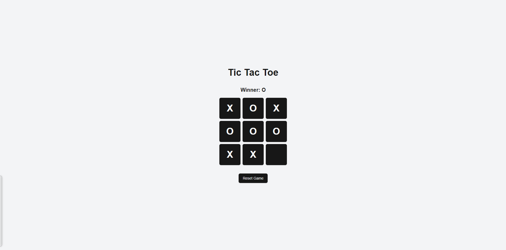

# AI-Powered Tic Tac Toe in Next.js

This project is a simple Tic Tac Toe game built with Next.js and AI, created in under 3 minutes with cursor AI code editor and V0.

## Features

- Play Tic Tac Toe multiplayer
- Responsive design for desktop and mobile
- Built with Next.js for fast performance

## Quick Start

1. Clone the repository
2. Install dependencies:
   ```bash
   npm install
   ```
3. Run the development server:
   ```bash
   npm run dev
   ```
4. Open [http://localhost:3000](http://localhost:3000) in your browser


## Technologies Used

- Next.js
- React
- TypeScript
- Tailwind CSS
- Shadcn UI

## Screenshots


## Contributing

Contributions are welcome! Please feel free to submit a Pull Request.

## License

This project is open source and available under the [MIT License](LICENSE).
